# GitHub LaunchBar Action

This is a GitHub [LaunchBar](https://www.obdev.at/products/launchbar) action
that can search various parts of GitHub based on your input.

<p align="center"></p>

## Actions

At any point you can either hit enter to navigate into available options, or
hit `⌘` + `enter` to go directly to the corresponding GitHub page.

### For a user or organization

<p align="center">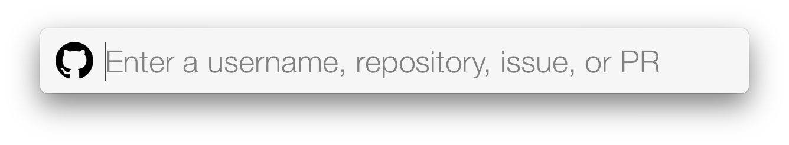</p>
<p align="center">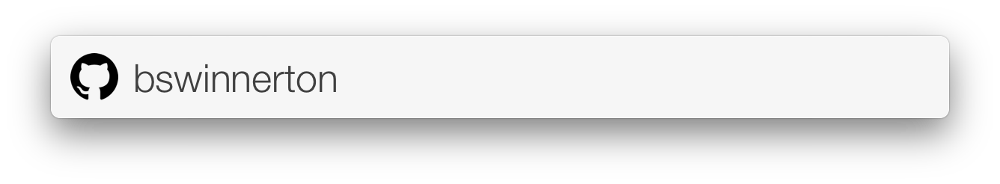</p>

Simply add a `/` to the end of a user or organization and the repositories will
be fetched:

<p align="center">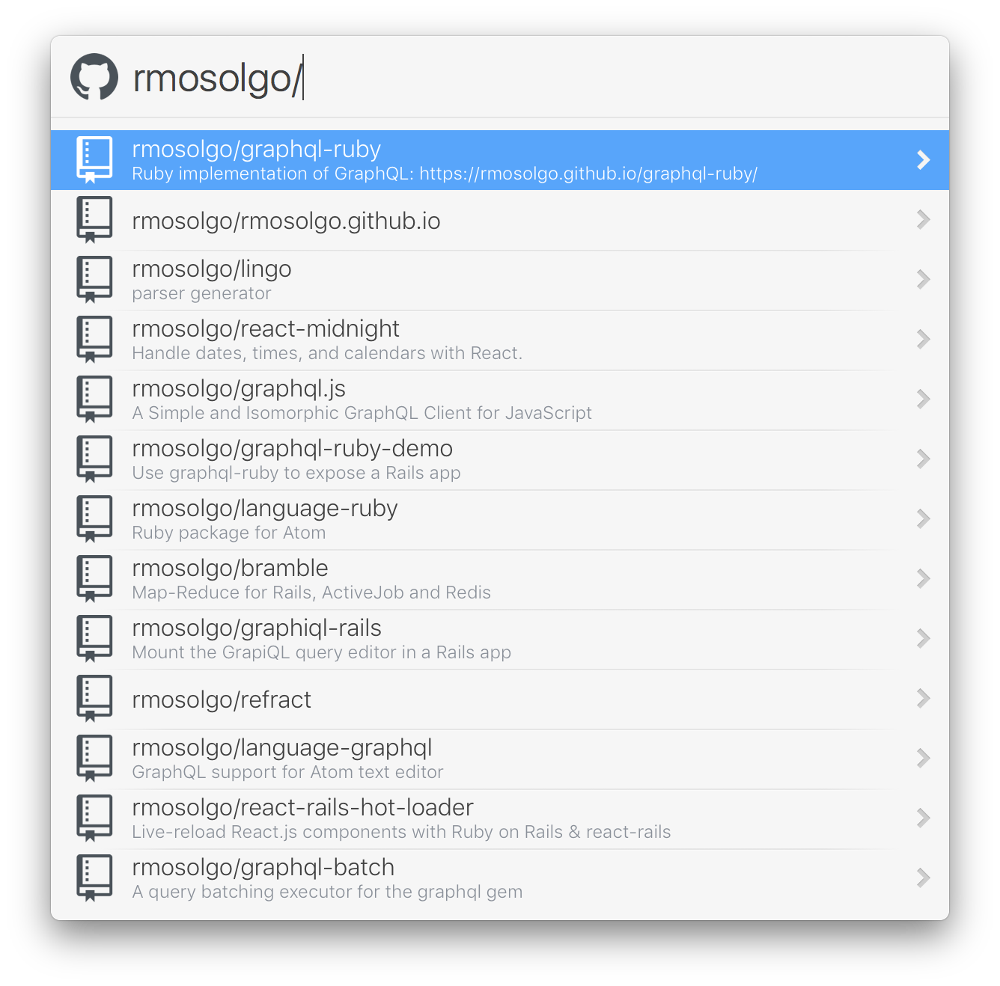</p>

### For a repository

<p align="center"></p>
<p align="center">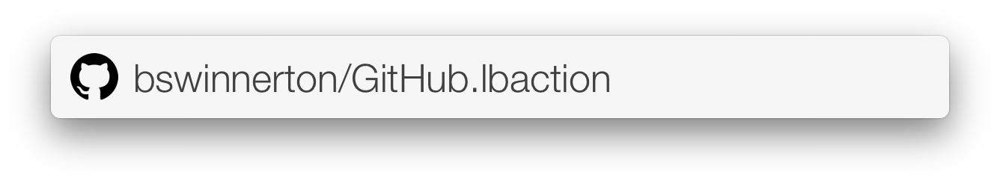</p>
<p align="center">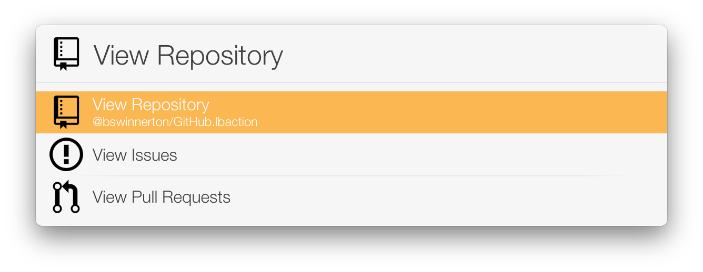</p>

### For an issue or pull request

<p align="center"></p>
<p align="center">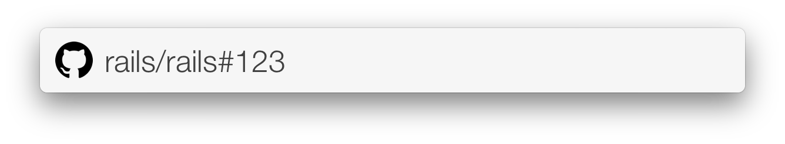</p>

### For a commit

At any time, paste a commit SHA into LaunchBar and hit `tab`. Start typing
"github" and you should see the action appear, hit `enter`. Once complete, the
action will bring you to the pull request that introduced the commit. If the
commit is associated with multiple pull requests, they will be displayed in a
list.

<p align="center">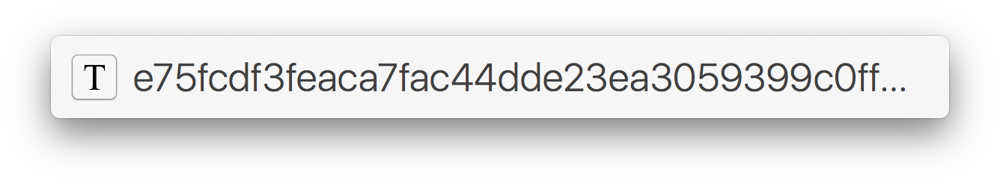</p>
<p align="center">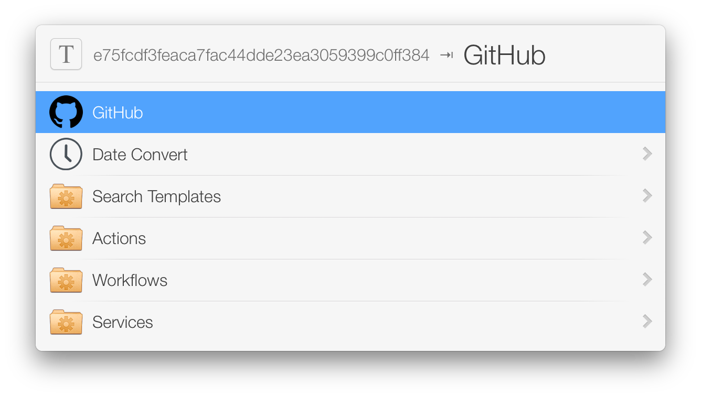</p>
<p align="center"></p>

### Shortening a link

At any time, paste a GitHub link into LaunchBar and hit `tab`. Start typing
"github" and you should see the action appear, hit `enter`. Once complete, the
action will ask you if you want to shorten the link, hit `enter` and the
shortened link will be copied to your clipboard.

<p align="center"></p>
<p align="center">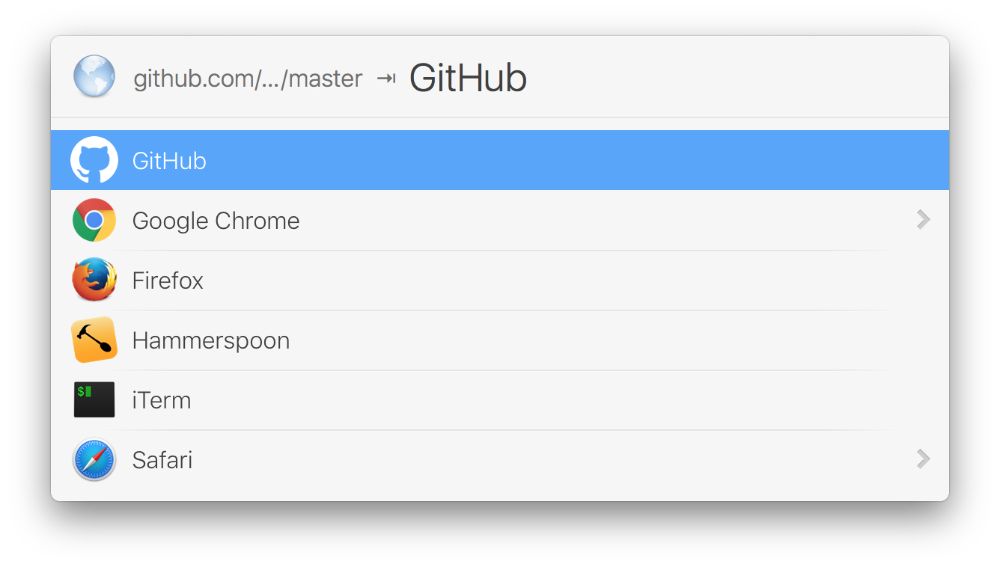</p>
<p align="center">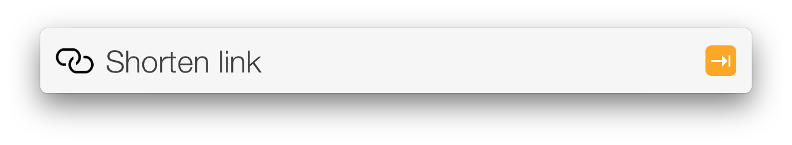</p>
<p align="center">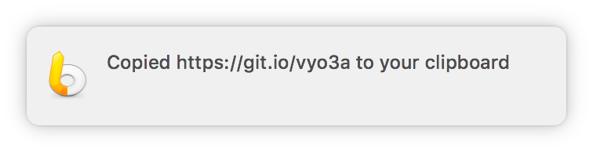</p>

## Installing

### Automatic

The easiest way to install this action is by visiting
http://launchbar-github.com/. You'll want to first
[Download](http://launchbar-github.com/download) and then
[Install](http://launchbar-github.com/install) the application.

When clicking on Install, you'll be prompted to sign in with GitHub and once
complete, will be automatically brought back into the LaunchBar application.

### Manual

If for any reason that doesn't work, the action can either be downloaded from
the [Releases](https://git.io/vyose) page, or if you'd like to use the latest
features as they come out (from `master`), you can clone this repository to
your LaunchBar Actions folder:

```
mkdir -p ~/Library/Application\ Support/LaunchBar/Actions/
git clone https://github.com/bswinnerton/launchbar-github ~/Library/Application\ Support/LaunchBar/Actions/github.lbaction
```

### GitHub Access Token

You'll need to get an access token from GitHub if you'd like to use any of the
features that return data directly in LaunchBar. To do so, go to
https://github.com/settings/tokens/new and create a new token with the `repo`
and `user` scopes selected. Copy the token to your clipboard and invoke the
GitHub action and select "Settings". From here, choose "Set GitHub access token
from clipboard".

## Updating

This action can be updated by pulling the latest changes from Git.

```
cd ~/Library/Application\ Support/LaunchBar/Actions/github.lbaction/
git pull origin master
```

In some cases, you may need to restart LaunchBar and regenerate a GitHub access
token.

## Development

This LaunchBar plugin is written in Javascript. Because I value both writing
Javascript in ES6, _and_ support for the action to run in older OS X
environments, [Babel](https://babeljs.io/) is used to convert the files in
`Contents/Scripts/` into "vanilla Javascript" that can be parsed by most OS X
JS engines.

If you're looking to contribute to this repository, you'll need to bootstrap
the project by running:

```
script/bootstrap
```

This will install all dependencies for you. From there, you can run:

```
script/server
```

Which will listen for changes to any files in `Contents/Scripts/` and
automatically compile your Javascript into a single file that can be executed by
LaunchBar.

If at any time you would like to run the tests, you can run:

```
script/test
```
