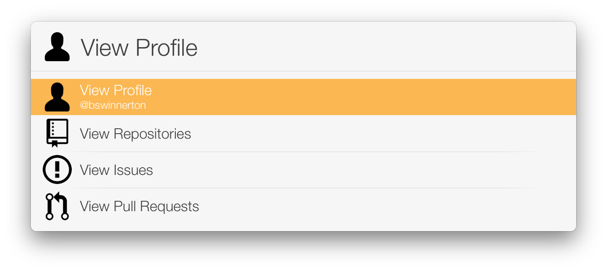

# GitHub LaunchBar Action

This is a GitHub [LaunchBar](https://www.obdev.at/products/launchbar) action
that can search various parts of GitHub based on your input.

## Actions

### For a user or organization





### For a repository


### For an issue or pull request


## Installing

Installing should be as simple as cloning this repository to your LaunchBar
Actions folder:

```
git clone https://github.com/bswinnerton/GitHub.lbaction ~/Library/Application\ Support/LaunchBar/Actions
```
